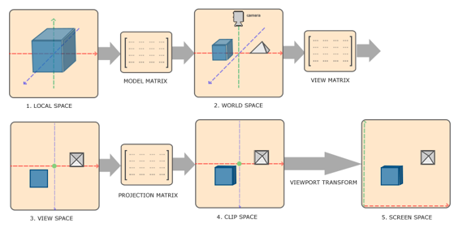
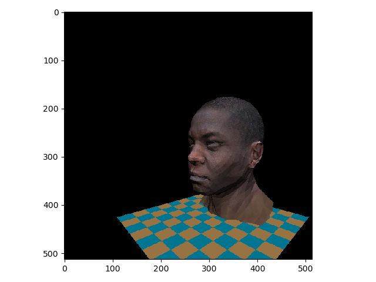
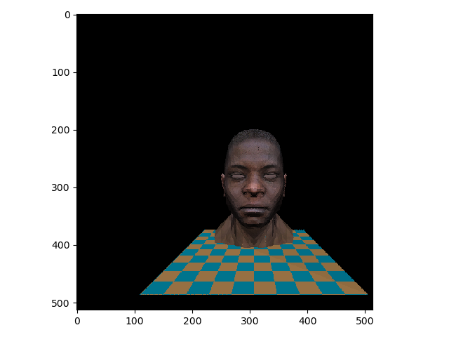
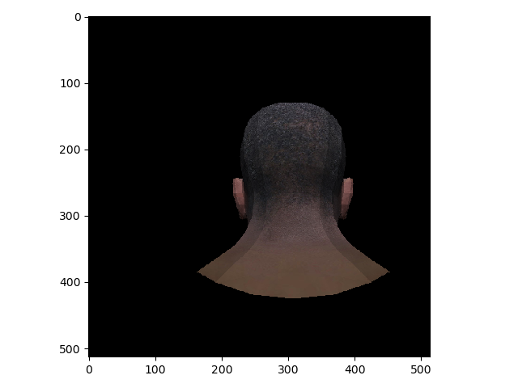
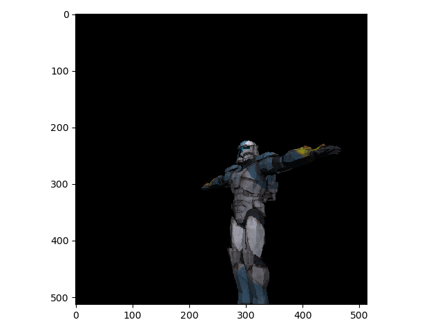

This project includes
   + A change of space
        
   + Projections: Orthographic and Perspective
   + Hiding polygons: Z-buffer
   + Lighting: Model of Lambert and Model of Fong
   + Add texture
   + Shading: Flat Shading and Model of Fong

Example Results:
   
   
   
   